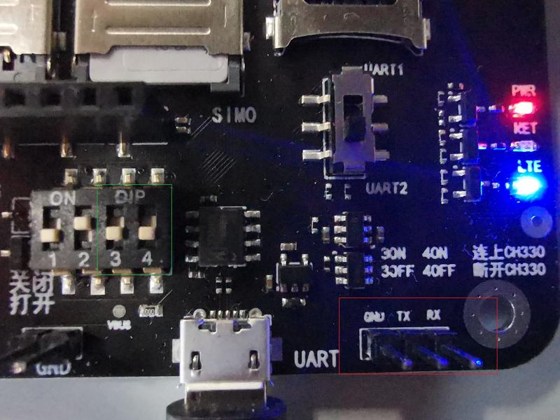

# rs485测试
+ 代码中为uart回环逻辑
+ 设置不同串口ID与波特率，观察回环是否正常

## RS485测试方法

**1.  前言**
我们模块有UART串口通信接口，但是UART通信方式抗干扰能力差，通信距离短。所以我们客户中是有UART转接485这种使用方式的。那么UART-485方式该如何编写脚本并测试呢？我们一步一步来，先来了解UART转485芯片MAX485


**1.  MAX485**
我们硬件的同事已经给我们提供了一套测试装备，见下图：


这套装置使用了两个MAX485和一个UART转USB芯片CH340，我左手是一个MAX485，我右手是一个MAX485+CH340。连接示意图如下：


其中，绿框里是我左手所拿的小板，蓝框里是我右手所拿的小板。

MAX485是一个8 引脚的芯片，是一个标准的485收发器，内含一个输出驱动器和一个数据接收器，只能进行半双工通信，由一个引脚来控制收和发的转换。

先了解下MAX485的引脚定义:
RO（引脚1)∶接收信号的输出引脚。可以把来自总线A和B引脚的总线信号，输出给模块。是COMS电平。
RE(引脚2〉:接收信号的控制引脚。当这个引脚低电平时，RO引脚有效，MAX485通过RO把来自总线的信号输出到模块;当这个引脚高电平时，RO引脚处于高阻状态。
DE:(引脚3)∶输出信号的控制引脚。当这个引脚低电平时，输出驱动器无效﹔当这个引脚高电平时，输出驱动器有效，来自DI引脚的输出信号通过A和B引脚被加载到总线上。是COMS电平。
DⅠ(引脚4)∶输出驱动器的输入引脚。是CMOS电平。当DE是高电平时，这个引脚的信号通过A和B脚被加载给总线。
A（引脚6): 连接到 RS485 总线的A端。
B  (引l脚7): 连接到 RS485 总线的B端。
Vcc(引脚8): 电源线引|脚。4V供电，可以直接连到724开发板4V引脚。
 
**3.  这套装置如何跟开发板和电脑连接**

第一步：
由于模块UART是1.8V电平，而MAX485是3.3V CMOS电平，所以请使用开发板右下角的经过转换的UART脚，见下图右下角红框内。
注：如果要使用这个UART脚，请将DIP3和4搬下来，即打到OFF。如下图绿框。



第二步：
然后将下图中小板的RO脚接上图开发板红框中RX，DI脚接上图开发板红框中TX，中间的RE和DE已经焊在一起，将这个RE脚接到开发板上脚本中设定的GPIO。然后小板上的VCC接开发板上4V的引脚，GND接开发板上的GND。


第三步：
最后，将我右手所示的小板，插到电脑USB口


**4. 测试demo 示例**

例如，如下脚本使用UART1转接485，使用GPIO23作为RE脚，设置GPIO23为高的时候发送数据，低的时候接收数据。测试PC 串口工具按照脚本中设定的波特率发送数据，模块收到数据后打印出来，并原样将数据发送回PC


```
require "utils"
require "pm"
require "pins"
require "misc"

module(...,package.seeall)

local function read1()
    local data = ""
  
    while true do
        data = uart.read(1, "*l")
       
        if not data or string.len(data) == 0 then break end
        log.info("<", string.toHex(data))
        uart.write(1, data)
    end
end

pm.wake("test")
uart.setup(1, 9600, 8, uart.PAR_NONE, uart.STOP_1, nil, 1);
uart.set_rs485_oe(1, pio.P0_23)
uart.on(1, "receive", read1)
```

